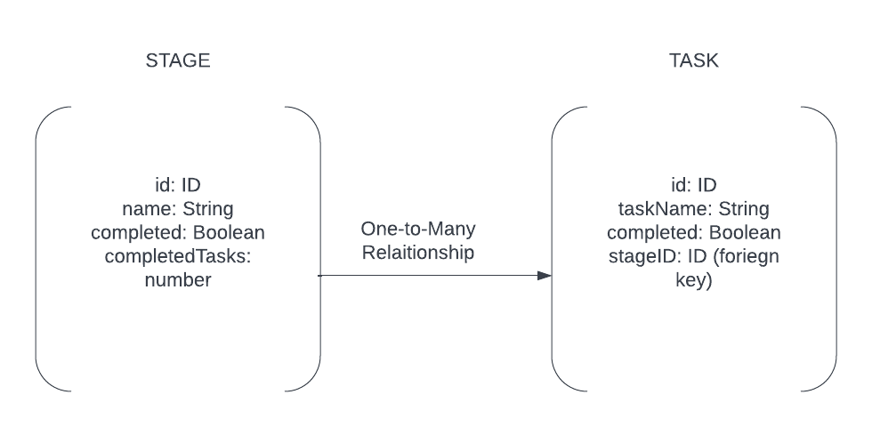

### Simyra Tech Test

To start the docker container which runs the main application code, enter the command `docker build -t simyra-tech-test .`

To run the on localhost:4000, enter the command `docker run -p 4000:4000 simyra-tech-test`

To see all the tests that are passing, exit the docker container and enter the command `npm install` in the terminal to install the dependancies then enter `npm test` to see all the tests passing

To view the interface, you can either go to the browser and visit localhost:4000/graphql or use postman if you want to test it out using that


## Queries and Mutations

Since this project has a GraphQL interface, theres 2 queries and 2 mutations, below are the possible values you can return from the schema

1) getStage(stageName: string)
```
query{
    getStage(stageName: "string"){
        name 
        tasks {
            taskName
            completed
        }
        completed 
        completedTasks
}}

```

2) getTask(taskName: string)

```
query{
    getTask(taskName: "string"){
        tasks {
            taskName
            completed
        }
}}

```

3) completeStage(stageName: "string")

```
mutation{
    completeStage(stageName: "string"){
        name 
        tasks {
            taskName
            completed
        }
        completed 
        completedTasks
}}

```

4) completeTask(taskName: string)

```
mutation{
    completeTask(taskName: "string"){
        tasks {
            taskName
            completed
        }
}}

```

### Database Design
For this solution, it would be a relatively simple database, ideally modelling this relationship between a Stage and a Task using a SQL Database, mySQL and PostgreSQL are popular choices



So this would be a One-To-Many relationship, as a Stage can have many Tasks, the relationship between them is represented by a foreign key on the Task table, which represents which Stage that Task belongs to